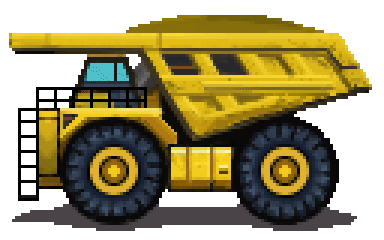

    

      
    

    

        
    

# Introduction

#### Under construction, a Minecraft building tool

# Will Support

- forge
- fabric
- levilamina
- browser (a structure editor developed with Unity Web)
- other mod loader of bedrock-edition, if any exist
